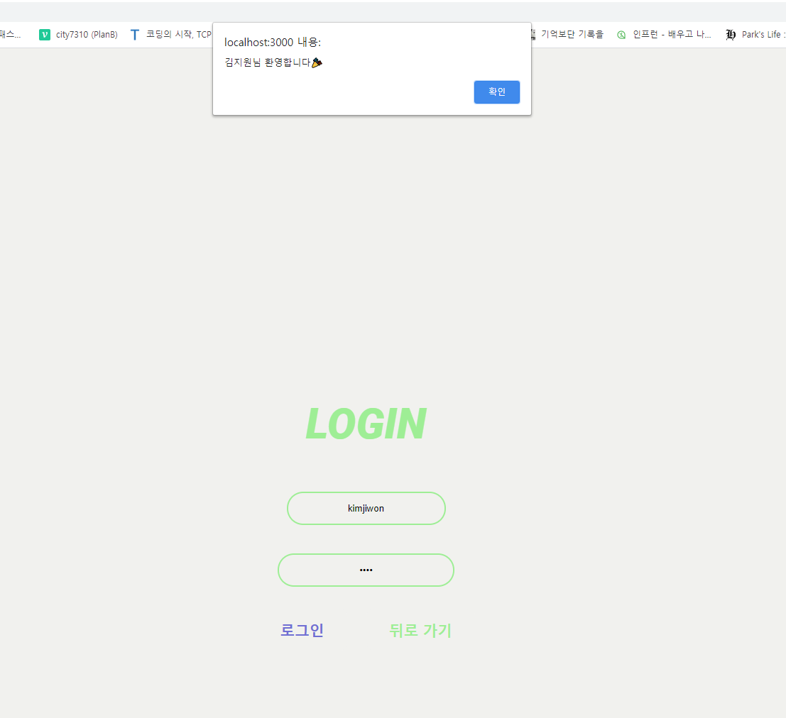

# login-signup

# 💻 목차
* main 화면
* 회원가입 화면
* 로그인 화면
* 로그인하면 들어가지는 화면

 

### 기능 설명
#### main화면에서 버튼을 통해 로그인 or 회원가입으로 들어간다  

#### 회원가입시 id와 pw 그리고 이름을 저장한다   회원가입시 적은 값들은 db에 저장된다.

#### 회원가입 완료시 main화면으로 돌아간다.

 

#### 로그인시 id와 pw를 적는다.

#### db와 일치하면 이름과 함께 alert가 뜨면서 welcome 화면으로 들어간다.

#### 틀리면 다시 적으라는 alert가 뜬다.

